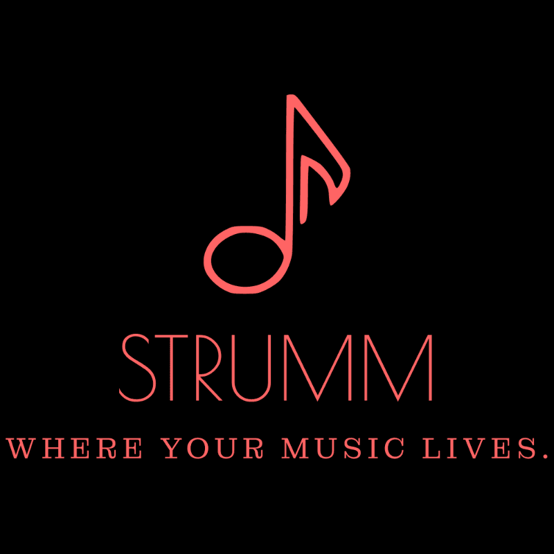

  
  <h1>Strumm</h1>
  
<em>Where your music lives. A premium, handcrafted music ecosystem.</em>

 

Welcome to **Strumm**, the ultimate music experience designed with aesthetics and functionality at its core. Say goodbye to generic music apps and discover an environment where every song, podcast, and playlist feels like a personalized listening journey.

## 🎵 Why Strumm?

Strumm isn't just another music player—it’s a carefully curated ecosystem built around your listening habits, offering high-fidelity audio handling, a stunning dynamic user interface, and an uninterrupted musical flow.

### Key Features
- **Dynamic Theme Engine**: Strumm adapts to your style. From "Obsidian" to "Ocean Drive", the interface transforms itself using our premium glassmorphism styling and ambient glow effects.
- **Live-Synced Theatre Mode**: Immerse yourself in the music with real-time, live-synced lyrics that automatically highlight to the rhythm of the track.
- **Podcast Support**: Seamlessly transition from your favorite tracks to daily podcasts without ever leaving the app.
- **Smart Queue & Shuffle**: Strumm’s intelligent queueing system ensures the music never unexpectedly stops, adapting beautifully whether you are on repeat, shuffle, or discovering new tracks.
- **Listening History & Stats**: Keep track of the music that defines your life. Your data is synced and visualized right inside your profile.
- **High-Fidelity Audio Controls**: Precision volume, playback speed adjustments, and seamless lock-screen Media Session integrations for your device.

## 🎧 Getting Started
Dive straight into your new dashboard. There's no complex setup required:
1. Search for your favorite artists or explore our curated playlists.
2. Select a track, sit back, and enjoy the **Theatre Mode** for live lyrics.
3. Personalize your workspace via the settings panel to tweak the visual aesthetics to your liking.

## 🤝 Community
Music is meant to be shared. You can generate custom share links directly from the Strumm interface to send playlists and tracks to friends, letting them experience exactly what you are hearing.

---

  Built with ❤️ for true music enthusiasts.

